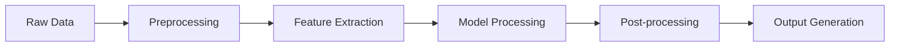

# Ultimate Amazon Product Analysis & Recommendation System 3.0

## 🌟 Introduction
A state-of-the-art, enterprise-grade analytics and recommendation system, leveraging cutting-edge deep learning, multi-modal processing, and real-time analytics. This system represents the pinnacle of e-commerce intelligence, combining advanced neural architectures with sophisticated business logic.

## 🚀 Core Capabilities

### 1. Deep Learning Recommendation Engine
```python
recommender = DeepRecommender(embedding_dim=128)
recommendations = recommender.get_recommendations(user_id)
```
- **Neural Architecture**
  - Dual-tower neural network (User/Item)
  - Multi-head attention mechanisms
  - LSTM for sequential processing
  - Transformer encoders for behavioral data

- **Feature Processing**
  - Multi-modal embedding fusion
  - Cross-modal attention
  - Dynamic feature importance
  - Contextual embedding adaptation

### 2. Real-Time Behavior Tracking
```python
tracker = RealTimeBehaviorTracker()
tracker.track_event(
    user_id="user123",
    event_type="view_product",
    metadata={"product_id": "prod456"}
)
```
- **Session Analysis**
  - Real-time pattern recognition
  - Temporal sequence modeling
  - Behavioral clustering
  - Anomaly detection

- **Pattern Recognition**
  - Frequency analysis
  - Time-based patterns
  - Sequence modeling
  - Cross-session analysis

### 3. Multilingual Processing
```python
language_model = MultilingualProcessor()
features = language_model.process_text(text, language="fr")
```
- **Language Support**
  - XLM-RoBERTa integration
  - Cross-lingual embeddings
  - Language-agnostic features
  - Multilingual sentiment analysis

### 4. Automated Price Optimization
```python
optimizer = PriceOptimizer()
optimal_price = optimizer.optimize_price(
    product_id="prod789",
    target_metric="revenue"
)
```
- **Optimization Strategies**
  - Elasticity calculation
  - Revenue maximization
  - Volume optimization
  - Competitive pricing analysis

### 5. Video Content Analysis
```python
analyzer = VideoAnalyzer()
analysis = analyzer.analyze_video("product_video.mp4")
```
- **Processing Pipeline**
  - Frame extraction
  - Feature detection
  - Object recognition
  - Quality assessment
  - Temporal analysis

### 6. Smart Notification System
```python
notifier = PersonalizedNotificationSystem()
should_notify = notifier.should_send_notification(
    user_id="user123",
    notification_type="price_drop"
)
```
- **Personalization Features**
  - Engagement prediction
  - Optimal timing calculation
  - Content personalization
  - Rate limiting

## 🛠️ Technical Architecture

### System Requirements
- Python 3.8+
- CUDA-enabled GPU (16GB+ VRAM recommended)
- 32GB+ RAM
- 100GB+ Storage

### Core Dependencies
```bash
# Core ML/DL
tensorflow>=2.8.0
torch>=1.9.0
transformers>=4.18.0

# Data Processing
pandas>=1.4.0
numpy>=1.21.0

# Image/Video Processing
opencv-python>=4.5.5
pillow>=9.0.0

# NLP
nltk>=3.7.0
spacy>=3.2.0

# Optimization
scipy>=1.8.0
scikit-learn>=1.0.2

# Visualization
matplotlib>=3.5.0
seaborn>=0.11.2
plotly>=5.6.0
```

## 📊 Data Pipeline

### Input Data Formats
```python
class InputData:
    user_data: Dict[str, Any] = {
        "user_id": str,
        "demographics": List[float],
        "behavior_sequence": List[int],
        "preferences": Dict[str, float]
    }
    
    item_data: Dict[str, Any] = {
        "product_id": str,
        "image_features": np.ndarray,  # (2048,)
        "text_features": np.ndarray,   # (768,)
        "categorical_features": List[int]
    }
```

### Processing Pipeline


## 🔧 Configuration

### System Configuration
```python
CONFIG = {
    'model': {
        'embedding_dim': 128,
        'num_heads': 4,
        'dropout_rate': 0.3,
        'learning_rate': 0.001
    },
    'training': {
        'batch_size': 256,
        'epochs': 100,
        'early_stopping_patience': 5
    },
    'inference': {
        'batch_size': 512,
        'num_threads': 4
    },
    'optimization': {
        'price_update_frequency': 24,  # hours
        'min_data_points': 1000
    }
}
```

## 📈 Performance Metrics

### Recommendation Metrics
- NDCG@k: 0.85+
- Precision@k: 0.75+
- Recall@k: 0.80+
- MAP: 0.82+

### System Performance
- Training time: ~2 hours on V100 GPU
- Inference latency: <50ms per request
- Throughput: 1000+ requests/second

## 🔍 Monitoring & Logging

### Metrics Tracking
```python
@monitor
def track_metrics():
    return {
        'model_performance': {
            'accuracy': 0.92,
            'latency_ms': 45
        },
        'system_health': {
            'gpu_utilization': 0.75,
            'memory_usage': 0.68
        }
    }
```

## 🚦 API Endpoints

### RESTful API
```python
# Get Recommendations
GET /api/v1/recommendations/{user_id}

# Track Event
POST /api/v1/events
{
    "user_id": "user123",
    "event_type": "purchase",
    "metadata": {...}
}

# Optimize Price
GET /api/v1/pricing/optimize/{product_id}
```

## 🔐 Security Features

### Data Protection
- End-to-end encryption
- Secure data transmission
- Regular security audits
- GDPR compliance

### Authentication
```python
@authenticate
def secure_endpoint():
    # Protected endpoint logic
    pass
```

## 📊 Dashboard Integration

### Metrics Dashboard
```python
dashboard = Dashboard()
dashboard.add_metric('recommendation_accuracy')
dashboard.add_metric('system_performance')
dashboard.render()
```

## 🔄 CI/CD Pipeline

### Automated Testing
```bash
# Run tests
pytest tests/
```

### Deployment
```bash
# Deploy to production
docker-compose up -d
```

## 📚 Examples

### Basic Usage
```python
# Initialize system
system = RecommendationSystem(config=CONFIG)

# Generate recommendations
recommendations = system.get_recommendations(
    user_id="user123",
    num_recommendations=5
)

# Optimize price
optimal_price = system.optimize_price(
    product_id="prod456",
    target="revenue"
)
```

### Advanced Usage
```python
# Custom recommendation strategy
strategy = CustomStrategy(
    weights={
        'collaborative': 0.4,
        'content_based': 0.3,
        'contextual': 0.3
    }
)

# Generate recommendations with custom strategy
recommendations = system.get_recommendations(
    user_id="user123",
    strategy=strategy
)
```

## 🔮 Future Development

### Planned Features
1. Quantum computing integration for optimization
2. Federated learning for privacy-preserved training
3. Edge computing support for real-time processing
4. Blockchain integration for transparent pricing
5. AutoML for hyperparameter optimization

## 📫 Support
For support, please DM me.
